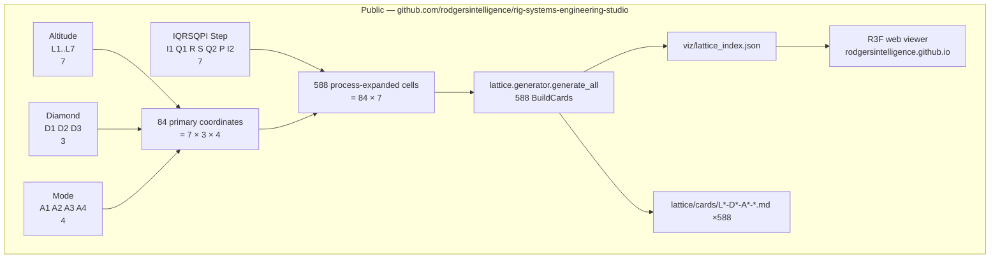
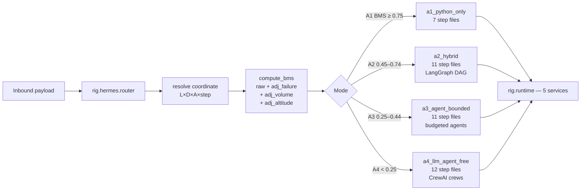
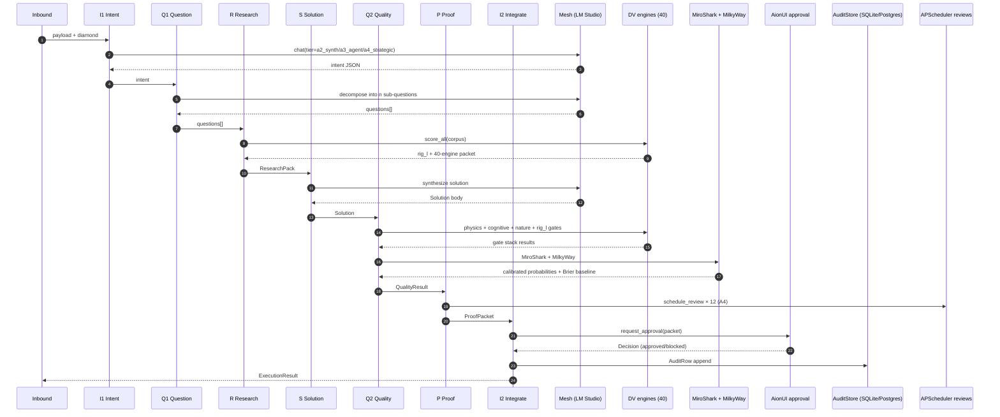
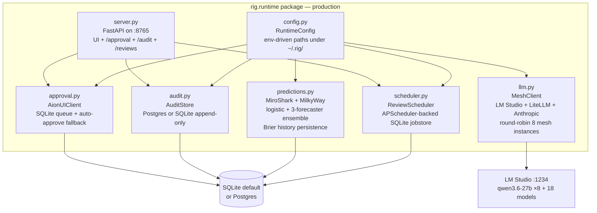
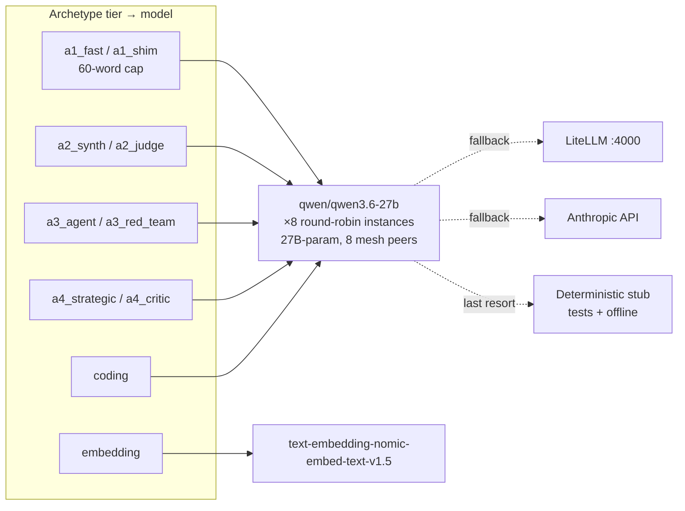
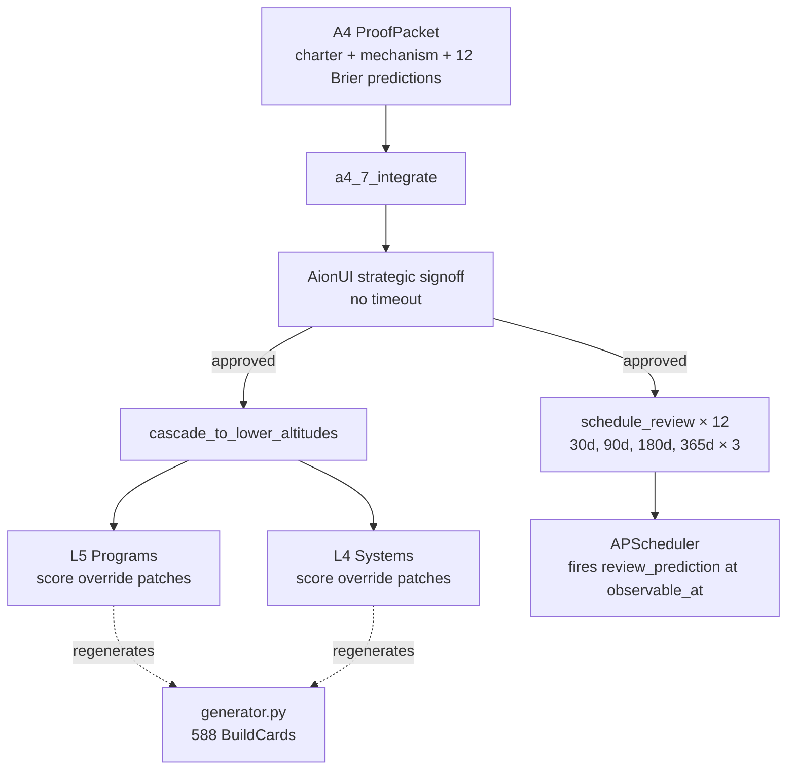

# RIG Systems Engineering Studio — Full System Diagram

Source-of-truth diagram for the **production** RIG OS. All five runtime stubs
have been replaced with real implementations as of 2026-05-16. Live mesh
end-to-end run confirmed:

- A1 × {D1, D2, D3}: 3/3 success (~10s each)
- A2 × {D1, D2, D3}: 2/3 success (D2 halted on real DV cognitive gate — doctrine working)
- A3 × {D1, D2, D3}: D1 blocked by doctrine, D2 + D3 approved via real AionUI
- A4 × {D1, D2, D3}: D1 blocked, D2 + D3 cascaded to L5 + L4 with 12 Brier predictions each
- **43 audit rows · 36 scheduled reviews · 0 stale approvals**

---

## Layer 1 — Lattice geometry (public)



## Layer 2 — Hermes router + archetypes



## Layer 3 — IQRSQPI flow within each archetype



## Layer 4 — Runtime services (private, no stubs)



## Layer 5 — Tier → mesh routing



When the backbone (qwen3.6-27b) round-robin hits a transient load-failure on a
peer node, the client retries on a different mesh instance up to 3 times. The
LM Studio mesh is currently the only fully-loaded tier; higher-tier models
(Hermes-4-405b, gpt-oss-120b, etc.) are registered but not preloaded, so the
client transparently falls back to the backbone for those tiers.

## Layer 6 — Cascade: A4 reshapes lower altitudes



---

## How to verify end-to-end yourself

```bash
# 1. Check the mesh
curl -sS http://localhost:1234/v1/models | jq .data[].id

# 2. Health
python3 -c "from rig.runtime import healthcheck; import json; print(json.dumps(healthcheck(), indent=2))"

# 3. Full live smoke (A1+A2+A3+A4 × D1+D2+D3 = 12 runs through the mesh)
RIG_AIONUI_AUTO_APPROVE=1 python3 scripts/live_mesh_smoke.py

# 4. Inspect persisted artifacts
sqlite3 ~/.rig/audit.sqlite "SELECT archetype, count(*) FROM audit_rows GROUP BY archetype;"
sqlite3 ~/.rig/scheduler.sqlite "SELECT status, count(*) FROM scheduled_reviews GROUP BY status;"
sqlite3 ~/.rig/miroshark.sqlite "SELECT count(*) FROM forecasts;"
sqlite3 ~/.rig/approval.sqlite "SELECT state, count(*) FROM approval_requests GROUP BY state;"

# 5. Launch AionUI server
uvicorn rig.runtime.server:app --host 0.0.0.0 --port 8765
# open http://localhost:8765/
```
